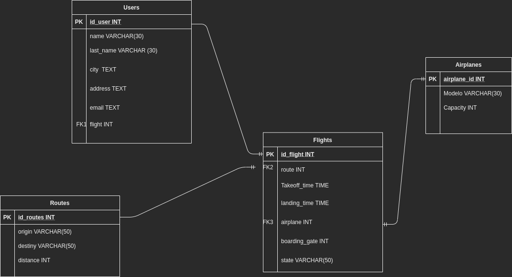

# Master X Day - BACKEND

Instructions:

1. Fork the project
2. Make your changes for each stage
3. Make a Pull Request
4. In url link eg. "https://github.com/PlatziMaster/Master-X-Day-Backend/compare/main...rafalagunas:main" you have to concatenate
   "?template=phase1.md" so your url looks like this => "https://github.com/PlatziMaster/Master-X-Day-Backend/compare/main...rafalagunas:main?template=phase1.md"
5. Create the pull request

# First stage

1. Image of database structure:

2. SQL script added
3. Template of Flask